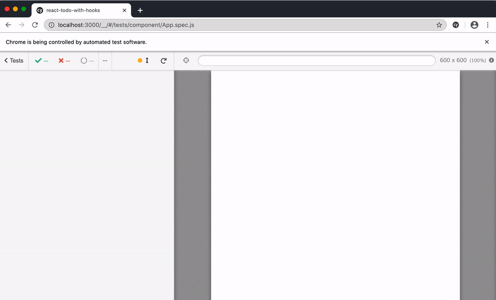

# react-todo-with-hooks    [![renovate-app badge][renovate-badge]][renovate-app]

End-to-end and component tests using [Cypress](http://github.com/cypress-io/cypress) and [cypress-react-unit-test](https://github.com/bahmutov/cypress-react-unit-test), read [My Vision for Component Tests in Cypress](https://glebbahmutov.com/blog/my-vision-for-component-tests/).

Example application copied from [codesandbox](https://codesandbox.io/s/oj3qm2zq06) from blog post [How To Build a React To-Do App with React Hooks](https://www.digitalocean.com/community/tutorials/how-to-build-a-react-to-do-app-with-react-hooks).

Test | Description
--- | ---
[cypress/integration/todo.spec.js](cypress/integration/todo.spec.js) | End-to-end test against application running at `localhost:3000`
[src/Todo.spec.js](src/Todo.spec.js) | Component test for `Todo` exported from `src/App.js`
[src/TodoForm.spec.js](src/TodoForm.spec.js) | Component test confirming `TodoForm` ignores empty input
[src/App.spec.js](src/App.spec.js) | Component test for `App` and unit test for `toggleOneTodo` exported from `src/App.js`

Tests capture code coverage (via `cypress-react-unit-test`), see created folder `coverage`.

[renovate-badge]: https://img.shields.io/badge/renovate-app-blue.svg
[renovate-app]: https://renovateapp.com/
